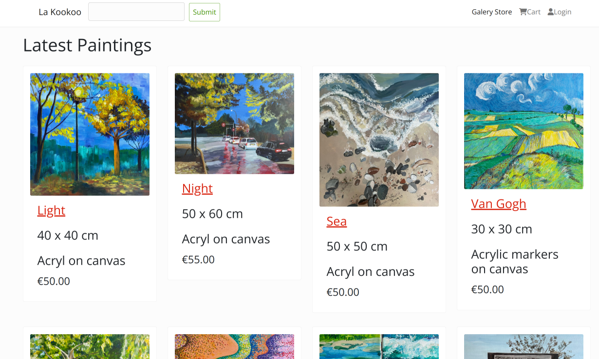

# Gallery Store





I created this project as a part of my portfolio.
It is a gallery where you can see my art and buy it.
I used Django for backend, and React, Redux and Bootstrap for frontend.

To buy something, you need to register there.

There's also paypal buttons, but I do not recommend to use them.
They're connected to some sandbox account and I have no idea what happens
if you try to pay.

Deployed here: https://lakookoo.herokuapp.com/


## Running locally

### Setup


```bash
git clone git@github.com:bunja/gallery-store.git

cd galery-store

pipenv install

cd frontend
npm install
cd ..
```

Next you need to start db container:

```bash
docker run -it \
  -e POSTGRES_USER="root" \
  -e POSTGRES_PASSWORD="root" \
  -e POSTGRES_DB="gallery_store_lakookoo" \
  -v gallery_store_lakookoo_db:/var/lib/postgresql/data \
  -p 5432:5432 \
  postgres:13
```

Create `.envrc`:

```bash
export DJANGO_AWS_ACCESS_KEY_ID='<YOUR KEY>'
export DJANGO_AWS_SECRET_ACCESS_KEY='<YOUR SECRET>'
export DJANGO_AWS_STORAGE_BUCKET_NAME='<YOUR BUCKET>'
export DB_USER='root'
export DB_NAME='gallery_store_lakookoo'
export DB_HOST='localhost'
export DB_PASSWORD='root'
```

Activate virtual environment:

```bash
pipenv shell
```

Now create database:

```bash
python mange.py migrate
```


### Running

Running backend:

```bash
cd galery-store 
python manage.py runserver
```

Running frontend:

```bash
cd frontend
npm start
```

Now open localhost:5000


## Deploying to Heroku

Create an app on Heroku.

Install heroku cli

```bash
heroku login
```

In heroku settings you need to add variables from `.envrc` to Config Vars.

Change local database to some remote database. For examle using RDS from AWS.

In buildpacks you need to add first Node.js, and than Python (in that order).

Now you ready to depoy:

```bash
git push heroku master
```